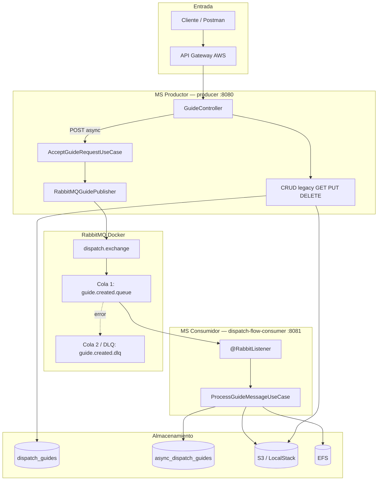
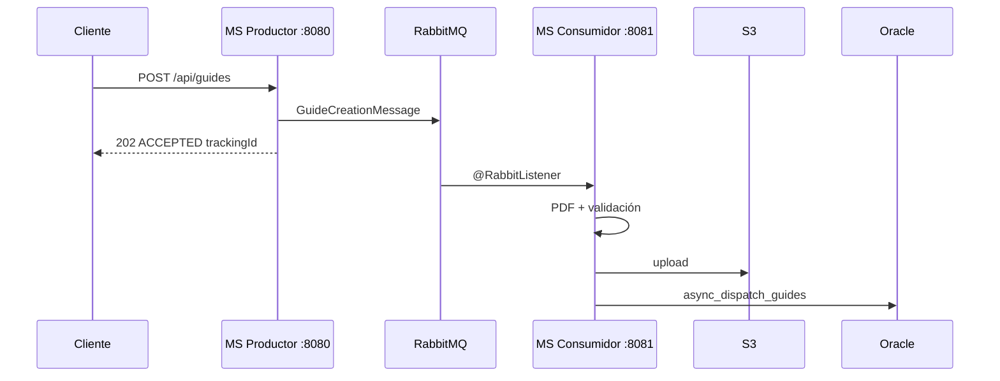

# dispatch-flow-api

API Gateway (AWS):** Cada endpoint de la API está configurado de manera explícita con su método HTTP correspondiente. Se eliminó el uso de la integración Proxy (`ANY /{proxy+}`) para garantizar un control de acceso granular y cumplir con las mejores prácticas de arquitectura. Ninguna petición anónima llega al servidor EC2.

## Seguridad e Identidad (IDaaS)

El sistema delega la identidad y la exposición a servicios administrados en la nube:
- **API Gateway (AWS):** Todos los endpoints están ocultos detrás de una integración Proxy (`ANY /{proxy+}`). Ninguna petición anónima llega al servidor EC2.
- **Azure AD B2C:** Actúa como proveedor de identidad. El API Gateway valida la firma del token JWT antes de permitir el enrutamiento.
- **Roles (RBAC):** El backend valida el claim `roles` (App Roles de Azure) con prefijo `ROLE_`:
  - `ROLE_DESCARGA`: Permite únicamente el endpoint de descarga de PDFs.
  - `ROLE_ADMIN`: Acceso total al resto de operaciones (CRUD y búsqueda).

## Arquitectura del sistema

El sistema se divide en **dos microservicios Spring Boot** conectados por **RabbitMQ**. El productor expone la API REST; el consumidor procesa las guías en segundo plano.

Documentación detallada: **[docs/arquitectura.md](docs/arquitectura.md)**

### Componentes y conexiones



### Flujo de creación asíncrona



### Módulos Maven

| Módulo | Puerto | Responsabilidad |
|--------|--------|-----------------|
| `producer` (`dispatch-flow-api`) | 8080 | API, publicar mensajes, CRUD `dispatch_guides` |
| `dispatch-flow-consumer` | 8081 | Consumir cola, PDF, S3, `async_dispatch_guides` |
| `guides-shared` | — | Dominio y contratos de mensajería compartidos |

## Requisitos

- Java 21
- Maven 3.9+ (incluido vía `./mvnw`)
- Docker (para desarrollo local con LocalStack y RabbitMQ)
- Wallet Oracle Autonomous DB (solo para `./run-prod` o Docker prod)
- Tenant de Azure AD B2C con App Roles `DESCARGA` y `ADMIN` asignados a la aplicación (para despliegue en la nube)

## Ejecutar en local (H2 + LocalStack + RabbitMQ)

```bash
chmod +x run-local run-consumer run-prod run-docker scripts/init-localstack.sh scripts/setup-oracle-wallet.sh scripts/setup-efs-mount.sh scripts/prepare-wallet-for-docker.sh
./run-local
```

En otra terminal, con RabbitMQ activo (`docker compose up -d`):

```bash
./run-consumer
```

- **MS Productor** (`run-local`): puerto **8080** — recibe `POST /api/guides` y publica en RabbitMQ.
- **MS Consumidor** (`run-consumer`): puerto **8081** — por defecto en **modo manual** (`DISPATCH_CONSUMER_LISTENER_ENABLED=false`): procesa con `POST /api/guides/process-next`. Con `true`, usa `@RabbitListener` automático. Genera PDF, sube a S3 y persiste en `async_dispatch_guides`.

Este script levanta LocalStack, crea el bucket `dispatch-flow-local`, inicia RabbitMQ y arranca el productor con perfil `local` usando **H2 in-memory**. En local **no se requiere token JWT**.

## Oracle en producción (`./run-prod`)

En local contra Oracle real (perfil `prod`):

```bash
# 1. Copiar wallet zip a la raíz del proyecto
cp /ruta/a/Wallet_DISPATCHFLOWDB.zip .

# 2. Configurar credenciales
cp .env.example .env
# Editar .env: SPRING_DATASOURCE_USERNAME, SPRING_DATASOURCE_PASSWORD, AWS_*

# 3. Arrancar
./run-prod
```

El script descomprime el wallet en `Wallet_DISPATCHFLOWDB/` (carpeta local, no versionada), carga `.env`, configura `TNS_ADMIN` y conecta a Oracle ATP. El alias TNS depende de tu wallet; el default es `dispatchflowdb_high`.

| Variable | Descripción |
|----------|-------------|
| `SPRING_DATASOURCE_URL` | Default: `jdbc:oracle:thin:@dispatchflowdb_high` (ajustar al alias de tu wallet) |
| `SPRING_DATASOURCE_USERNAME` | Usuario Oracle |
| `SPRING_DATASOURCE_PASSWORD` | Contraseña Oracle |
| `TNS_ADMIN` | Default: `./Wallet_DISPATCHFLOWDB` |
| `AWS_REGION` | Región S3 |
| `S3_BUCKET_NAME` | Bucket prod (`dispatch-flow-prod`) |

Archivos del wallet no se versionan (carpeta `Wallet_DISPATCHFLOWDB/` y `*_base64.txt` en `.gitignore`). Cada desarrollador/fork provee su propio zip local y configura el secret `ORACLE_WALLET_BASE64` en **su** repositorio de GitHub. No versionar `.env` ni el contenido del wallet.

### Multi-fork: Oracle por fork

Si trabajas desde un **fork**, configura los secrets en **Settings → Secrets and variables → Actions** del **fork** (no del upstream). Cada fork debe usar su propia Autonomous Database:

| Secret | Quién lo define | Notas |
|--------|-----------------|-------|
| `ORACLE_WALLET_BASE64` | Cada fork | Zip del wallet de **su** ATP en base64 |
| `SPRING_DATASOURCE_USERNAME` / `PASSWORD` | Cada fork | Usuario de **su** ATP |
| `SPRING_DATASOURCE_URL` | Cada fork | Alias TNS de **su** wallet (ej. `jdbc:oracle:thin:@midb_high`) |
| `DOCKERHUB_*`, `EC2_*`, `AWS_*`, `AZURE_*`, `RABBITMQ_*` | Cada fork | Infraestructura propia |

Local: `cp /ruta/a/Wallet_DISPATCHFLOWDB.zip .` → `./scripts/setup-oracle-wallet.sh` / `./run-prod`. **Nunca** hagas commit de `Wallet_DISPATCHFLOWDB/`, `nuevo_base64.txt` ni `*_base64.txt`. Los PRs al upstream no deben incluir diffs de wallet.

Detalle de secrets y despliegue en EC2: [docs/guia-despliegue-ec2.md](docs/guia-despliegue-ec2.md).

## Ejecutar con Docker (prod local)

Simula producción en contenedor (`dispatch-flow-api:local`) con Oracle ATP, S3 real y EFS simulado en `./tmp/efs-docker`:

```bash
# 1. Copiar wallet zip a la raíz del proyecto
cp /ruta/a/Wallet_DISPATCHFLOWDB.zip .

# 2. Configurar credenciales
cp .env.example .env
# Editar .env: SPRING_DATASOURCE_USERNAME, SPRING_DATASOURCE_PASSWORD, AWS_*

# 3. Build + run
./run-docker
```

El script prepara `wallet/` para la imagen, construye `dispatch-flow-api:local`, levanta el contenedor `dispatch-flow-api` en el puerto 8080 y monta `./tmp/efs-docker` en `/app/efs`.

| Artefacto | Nombre |
|-----------|--------|
| Imagen local | `dispatch-flow-api:local` |
| Imagen Docker Hub | `{DOCKERHUB_USERNAME}/dispatch-flow-api:latest` |
| Contenedor | `dispatch-flow-api` |

Despliegue completo vía Docker Hub: [docs/guia-despliegue-ec2.md](docs/guia-despliegue-ec2.md).

## Ejecutar tests

```bash
./mvnw test
```
Los tests E2E usan almacenamiento S3 en memoria (`dispatch.storage.s3.enabled=false`) y la autoconfiguración de RabbitMQ se deshabilita durante la ejecución para garantizar que el entorno CI sea rápido y estable sin depender de brokers externos.


## Almacenamiento EFS (local / producción)

| Variable | Local (default) | EC2 Linux (prod) |
|----------|-----------------|------------------|
| `EFS_BASE_PATH` | `./tmp/efs` | `/app/efs` (dentro del contenedor) |
| Mount en host | No aplica | `/mnt/dispatch-flow-efs` (AWS EFS) |

## Arquitectura asíncrona (RabbitMQ)

Ver diagramas completos en **[docs/arquitectura.md](docs/arquitectura.md)**.

RabbitMQ local: `docker compose up -d` — puertos **5672** (AMQP) y **15672** (consola).

| Variable | Local (default) | Producción |
|----------|-----------------|------------|
| `RABBITMQ_HOST` | `localhost` | `rabbitmq-dispatch` (EC2) |
| `RABBITMQ_PORT` | `5672` | `5672` |
| `RABBITMQ_USER` | `guest` | secret CI |
| `RABBITMQ_PASS` | `guest` | secret CI |
| `DISPATCH_CONSUMER_LISTENER_ENABLED` | `false` | secret CI (default `false` = manual) |

Al **crear** una guía vía `POST /api/guides` (flujo asíncrono):

1. El productor valida la solicitud y publica `GuideCreationMessage` en RabbitMQ.
2. Responde `202 Accepted` con `{ "status": "ACCEPTED", "trackingId": "..." }`.
3. Con listener **apagado** (default): llamar `POST http://localhost:8081/api/guides/process-next` (JWT `ROLE_ADMIN` en prod) para generar PDF, subir a S3 y guardar en `async_dispatch_guides`.
4. Con `DISPATCH_CONSUMER_LISTENER_ENABLED=true`: el consumidor procesa solo con `@RabbitListener`.

Al **actualizar** una guía existente (`PUT /api/guides/{id}`), el productor sigue el flujo síncrono sobre `dispatch_guides` (PDF + EFS + S3).

### EFS en EC2 (deploy con Docker Hub)

Antes del primer deploy, monta tu EFS en el EC2 siguiendo **[docs/configuracion-efs-ec2.md](docs/configuracion-efs-ec2.md)** (comandos manuales; no hace falta clonar el repo en el servidor).

El workflow enlaza `-v /mnt/dispatch-flow-efs:/app/efs`. Resumen del despliegue: [docs/guia-despliegue-ec2.md](docs/guia-despliegue-ec2.md).

### EFS local (`./run-prod`)

En `.env` puedes usar `EFS_BASE_PATH=./tmp/efs` sin montar AWS EFS. Opcionalmente existe `scripts/setup-efs-mount.sh` (solo referencia local; ver disclaimer en el script).

## Almacenamiento S3

| Variable | Local (LocalStack) | Producción |
|----------|-------------------|------------|
| `DISPATCH_STORAGE_S3_ENABLED` | `true` | `true` |
| `S3_BUCKET_NAME` | `dispatch-flow-local` | `dispatch-flow-prod` |
| `AWS_S3_ENDPOINT` | `http://localhost:4566` | *(vacío — AWS real)* |
| `AWS_ACCESS_KEY_ID` | `test` | IAM / env |
| `AWS_SECRET_ACCESS_KEY` | `test` | IAM / env |
| `AWS_SESSION_TOKEN` | *(opcional)* | *(si aplica)* |
| `AWS_REGION` | `us-east-1` | región del bucket |

Estructura de claves S3 (igual que rutas EFS relativas):

```
guides/{fecha}/{transportista-slug}/guide-{id}.pdf
```

Verificar objetos en local:

```bash
awslocal s3 ls s3://dispatch-flow-local/guides/ --recursive
```

**Delete:** marca la guía como `DELETED` en BD y luego borra el objeto S3 (si existe).

> **Oracle / `async_dispatch_guides`:** el check de `STATUS` debe permitir `PROCESSED`, `FAILED` y `DELETED`. Si solo admite los dos primeros, el DELETE vía API falla con 500 (`ORA-02290`) y `ddl-auto=update` no corrige ese CHECK. Ampliar o recrear el constraint incluyendo `'DELETED'`.

**Download:** lee desde S3 si hay `s3Key`; fallback a EFS para datos legacy.

## Consola H2

Con la aplicación en ejecución:

| Campo | Valor |
|-------|-------|
| URL | http://localhost:8080/h2-console |
| JDBC URL | `jdbc:h2:mem:dispatchflow` |
| Usuario | `sa` |
| Contraseña | *(vacía)* |

## Endpoints Protegidos

Todas las peticiones en producción deben incluir el header `Authorization: Bearer <Token>`.

En **producción** (perfil `prod`) todos los endpoints requieren `Authorization: Bearer <Token>` excepto `/actuator/health`. En **local** (perfil `local`) los endpoints son accesibles sin autenticación.

| Método | Ruta | Descripción | Rol Requerido (prod) |
|--------|------|-------------|----------------------|
| POST | `/api/guides` | Aceptar solicitud y publicar en RabbitMQ (procesamiento asíncrono) | `ROLE_ADMIN` |
| GET | `/api/guides/{id}` | Obtener por ID | `ROLE_ADMIN` |
| GET | `/api/guides/{id}/download` | Descargar PDF (S3 preferido) | `ROLE_DESCARGA` o `ADMIN` |
| GET | `/api/guides` | Listar guías activas | `ROLE_ADMIN` |
| PUT | `/api/guides/{id}` | Actualizar guía y regenerar PDF + S3 | `ROLE_ADMIN` |
| DELETE | `/api/guides/{id}` | Borrar objeto S3 + eliminación lógica | `ROLE_ADMIN` |
| GET | `/api/guides/search?carrierName=&date=` | Buscar por transportista y fecha | `ROLE_ADMIN` |

La eliminación es lógica (`status = DELETED`); las guías eliminadas no aparecen en listados ni búsquedas. Las guías creadas por el flujo asíncrono se persisten en `async_dispatch_guides` (consumidor) y no aparecen en los listados del productor hasta una integración futura.

### Flujo CI/CD (GitHub Actions)

El proyecto cuenta con integración y despliegue continuo configurado para AWS EC2.

|Evento              |Accion del pipeline|
|--------------------|-------------------|
|Pull Request > Main | Solo `./mvnw test`  |
|Push > Main         | Tests, build, push a Docker Hub, deploy automatizado por ssh|


## Ejemplo Postman: crear guía (Local)

**POST** `http://localhost:8080/api/guides`

```json
{
  "carrierName": "Transportes Rápidos",
  "recipientName": "María González",
  "originAddress": "Av. Providencia 1234, Santiago",
  "destinationAddress": "Calle Huérfanos 567, Santiago",
  "description": "Electrónicos",
  "dispatchDate": "2026-06-02",
  "ownerEmail": "responsable@empresa.cl"
}
```

Respuesta esperada: `201 Created` con `id`, `guideNumber`, `efsPath`, `s3Key` y `status: UPLOADED_TO_S3`.

Verificar EFS: `./tmp/efs/guides/2026-06-02/transportes-rapidos/`

Verificar S3: `awslocal s3 ls s3://dispatch-flow-local/guides/2026-06-02/transportes-rapidos/`

Colección Postman: [`postman/dispatch-flow-api.postman_collection.json`](postman/dispatch-flow-api.postman_collection.json)

## Ejemplo Postman: crear guía (Producción)

**POST** `https://<TU-API-GATEWAY-URL>/api/guides`  
**Headers:** `Authorization: Bearer <TOKEN_ADMIN>`

```json
{
  "carrierName": "Transportes Rápidos",
  "recipientName": "María González",
  "originAddress": "Av. Providencia 1234, Santiago",
  "destinationAddress": "Calle Huérfanos 567, Santiago",
  "description": "Electrónicos",
  "dispatchDate": "2026-06-02",
  "ownerEmail": "responsable@empresa.cl"
}
```

Respuesta esperada: `201 Created` con `id`, `guideNumber`, `efsPath`, `s3Key` y `status: UPLOADED_TO_S3`.

## Ejemplo Postman: descargar PDF (Local)

**GET** `https://<TU-API-GATEWAY-URL>/api/guides/{id}/download`  
**Headers:** `Authorization: Bearer <TOKEN_DESCARGA>`

Respuesta: `200 OK`, `Content-Type: application/pdf`, archivo adjunto `guide-{id}.pdf`.

## Ejemplo Postman: descargar PDF (Producción)

**GET** `https://<TU-API-GATEWAY-URL>/api/guides/{id}/download`  
**Headers:** `Authorization: Bearer <TOKEN_DESCARGA>`

Respuesta: `200 OK`, `Content-Type: application/pdf`, archivo adjunto `guide-{id}.pdf`.

## Ejemplo Postman: búsqueda (Local)

**GET** `http://localhost:8080/api/guides/search?carrierName=Transportes%20Rápidos&date=2026-06-02`

## Ejemplo Postman: búsqueda (Producción)

**GET** `https://<TU-API-GATEWAY-URL>/api/guides/search?carrierName=Transportes%20Rápidos&date=2026-06-02`  
**Headers:** `Authorization: Bearer <TOKEN_ADMIN>`

## Arquitectura hexagonal y módulos

El proyecto es un **monorepo Maven multi-módulo** con arquitectura hexagonal (inside-out) en cada microservicio:

- **`guides-shared`**: dominio, value objects, `GuideCreationMessage`, `RabbitMqTopology`
- **`producer`**: casos de uso del productor, puerto `GuideMessagePublisher`, adaptadores JPA/S3/RabbitMQ, controladores REST
- **`dispatch-flow-consumer`**: `ProcessGuideMessageUseCase`, `POST /api/guides/process-next`, `@RabbitListener` opcional, persistencia `async_dispatch_guides`

Capas por módulo:

- **Dominio** (`guides-shared`): entidades, value objects, reglas de negocio
- **Aplicación**: casos de uso, puertos PDF/EFS/S3/mensajería
- **Infraestructura**: JPA, PDFBox, S3, RabbitMQ, Spring Security (JWT en `prod`)

Diagrama de componentes y flujos: **[docs/arquitectura.md](docs/arquitectura.md)**

## Health check (Público en prod)

```bash
curl https://<TU-API-GATEWAY-URL>/actuator/health
# o localmente: curl http://localhost:8080/actuator/health
```
